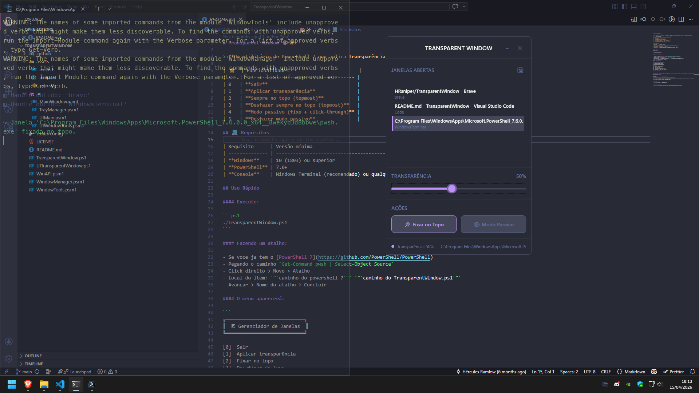

# Transparent Window 🎨✨

> **Um utilitário de PowerShell 7 que aplica transparência, top‑most e modo passivo a janelas do Windows.**

<table>
<tr>
<td valign="center" >
<b>Interface Gráfica (GUI)</b>
<br/>

</td>
<td>

|     | Funcionalidades (CLI)                   |
| :-- | :-------------------------------------- |
| 0   | **Sair**                                |
| 1   | **Aplicar transparência**               |
| 2   | **Sempre no topo (topmost)**            |
| 3   | **Desfazer sempre no topo**             |
| 4   | **Modo passivo (fixo + click‑through)** |
| 5   | **Desfazer modo passivo**               |

</td>
</tr>
</table>

## 💻 Requisitos

| Requisito      | Versão mínima                                    |
| -------------- | ------------------------------------------------ |
| **Windows**    | 10 (1803) ou superior                            |
| **PowerShell** | 7.0+                                             |
| **Console**    | Windows Terminal (recomendado) ou qualquer outro |

## Uso Rápido

#### Execute (CLI):

```ps1
./TransparentWindow.ps1
```

#### Execute (GUI):

```ps1
./UITransparentWindow.ps1
```

#### Fazendo um atalho:

- Se voce ja tem o [PowerShell 7](https://github.com/PowerShell/PowerShell)
- Pegando o caminho `Get-Command pwsh | Select-Object Source`
- Click direito > Novo > Atalho
- Local do item: exemplo: `"C:\Program Files\WindowsApps\Microsoft.PowerShell_7.6.0.0_x64__8wekyb3d8bbwe\pwsh.exe"` `"C:\Users\$env:USERNAME\Downloads\TransparentWindow\TransparentWindow.ps1"`
- Avançar > Nome do atalho > Concluir

#### Atalho para GUI:

- Para ver a GUI a entrada é `UITransparentWindow.ps1`
- Para mininizar terminal quando abrir a GUI `-WindowStyle Hidden -File` coloque entre caminho do powershell e do app

#### O menu aparecerá:

```
╔════════════════════════════╗
║  ◩ Gerenciador de Janelas  ║
╚════════════════════════════╝

[0]  Sair
[1]  Aplicar transparência
[2]  Fixar no topo
[3]  Desafixar do topo
[4]  Fixar no topo (modo passivo)
[5]  Desafixar do topo (modo passivo)

↑ Escolha uma opção:
```

Siga as instruções interativas – o script exibe a lista de janelas visíveis e permite a aplicação em cada uma separadamente.

## 🆘 Problemas Comuns

| Problema             | Causa provável                       | Solução                                                                                                                                |
| -------------------- | ------------------------------------ | -------------------------------------------------------------------------------------------------------------------------------------- |
| Erro “Access denied” | Policy de execução está “Restricted” | Vai no arquivos `TransparentWin.ps1`, `WinAPI.psm1`, `WindowManager.psm1`, `WindowTools.psm1` copia e cola com salvando com mesmo nome |

## 📜 Licença

- [License](LICENSE) – Liberdade total

## 📢 Referência

- [Microsoft win32 api](https://learn.microsoft.com/en-us/windows/win32/api/winuser)
- [Microsoft windows desktop api](https://learn.microsoft.com/pt-br/dotnet/api/?view=windowsdesktop-11.0)
- [Microsoft net api](https://learn.microsoft.com/pt-br/dotnet/api/?view=net-11.0)
- [Microsoft windows presentation foundation](https://learn.microsoft.com/pt-br/dotnet/desktop/wpf)
